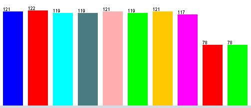
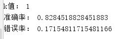
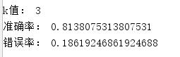
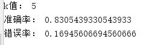
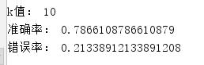
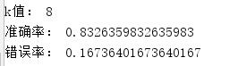
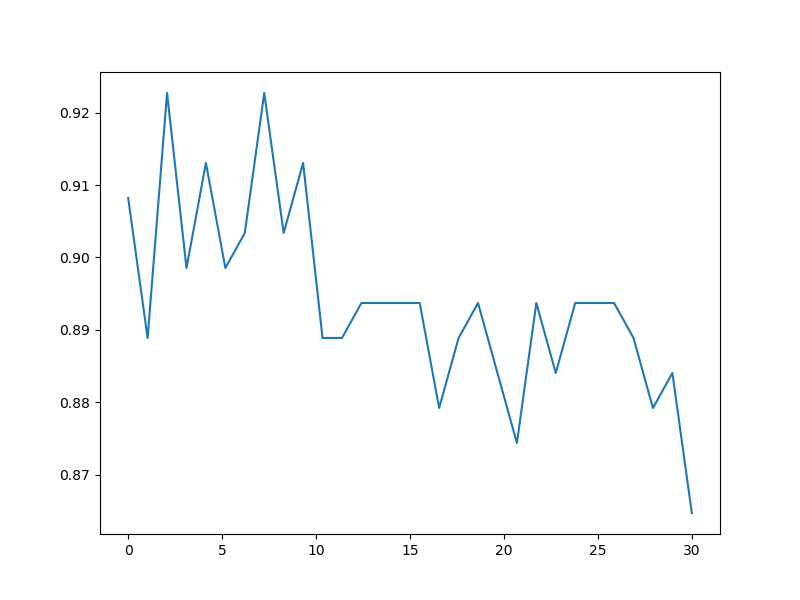

# 机器学习第一次作业 机器学习平台python和matlab的熟悉

## 1 问题描述

#### 1 用python或者matlab编写一个KNN分类器

  - 训练集为semeion_train.csv
  - 测试集为semeion_test.csv
  - 计算在测试集上的错误率（k = 1 3 5 7）
  
#### 2 选做
  
  - 在训练集上划分一个交叉验证集（可以是训练集数据的20%左右），利用交叉验证选择k值
  - 画一个以k值为x轴，交叉验证集错误率为y的曲线

#### 3 本次实验的简要介绍

- 实验内容
  
  本次实验使用kNN算法实现手写数字的识别。数据有256个特征值，代表了一个16*16的位图的像素值，0为无像素，1为存在像素。利用python PIL做出其中各个数字的典型图像如下所示：

                

- kNN算法简介
  
  kNN算法是一种监督学习算法。假设给定一个训练数据集，其中的实例类别已经确定。分类是对于新的类别，根据其最相近的k个邻居的类别，通过多数表决的方式进行预测。利用训练集对特征空间进行分类划分，并作为其分类的模型。


## 2. 解决方法

### 1 解决思路

- 计算待分类点与已知类别的点之间的距离
- 按照距离递增次序排序
- 选取与待分类点距离最小的k个点
- 确定前k个点所在类别的出现次数
- 返回前k个点出现次数最高的类别作为待分类点的预测分类
- 出现次数相同且最高的类别，按照距离远近进行预测分类

### 2 基本理论

- 距离的度量
  - 本次实验采用欧式距离
- 分类决策标准
  - 多数表决
  - 加权统计
- 交叉验证
  - 按照题目进阶要求，采用交叉验证的方式选取最好的k值

## 3 实验及分析

### 1 对数据的简单分析

在完成实验之前，利用weka对数据进行了简单的分析，如图所示：

 

观察图像可以看出，数字8和数字9在训练集中出现的次数与其他数字出现的比例大概为2:3。所以在算法中，我增加了数字8和数字9的权重，以减弱因其数量较少造成的偏差。

### 2 优化

- 欧氏距离的计算
  - 由于数据集中特征值均为0，1. 计算欧式距离的时候，（v1 - v2 ）^ 2 等价于 当 v1 != v2时， 距离加一。 从而减少了乘法的执行次数
- 排序算法的优化
  - 最初采用全排序找到前k个。优化成为使用堆排序，返回前k个值。
    代码如下：
    ```python
    # 取距离最近的前k个值，并记录其对应的下标
    def knn(distance_list, k):
        # 方案一 使用numpy中的函数argsort()实现（猜想该函数的复杂度较高，所以自己写排序函数）
        temp = np.argsort(distance_list)
        temp_res = []
        for i in range(k + 1):
            temp_res.append(temp[i])

        # 方案二 堆排序
        temp_res = list(map(distance_list.index, heapq.nsmallest(k+1, distance_list)))

        # -------------- 原方案 ------------------------
        temp_res = np.array(range(0, k+1)).reshape(1,k+1)
        for i in range(k+1):
            temp_res[0][i] = 256
    
        for i in range(len(distance_list)):
            for j in range(k+1):
                if distance_list[i] < temp_res[0][j]:

                    for l in range(k - j):
                        temp_res[0][k - l] = temp_res[0][k - l]
                    temp_res[0][j] = i
                    break

        return temp_res

    ```
- 特征权重
  - 通过观察训练集的特征，发现其中数字8，9的个数与其他数字的个数比为2：3, 所以为了消除个数对其的影响，给数字加上权重，代码中刚开始的处理方式是加权，即乘以1.5，但是由于这样子做的话需要统计每个数字的个数并且再乘以权值之后再次进行比较，实现比较麻烦。所以此处采用等效的方式，如果结果不是8或9，就在有序链表尾添加两个，是8或9就添加3次。然后直接调用pythont提供的优化过性能的api，实现这一功能。代码如下：

    ```python
    # 分析得到的k个值，确定包含最多的类别，对于相同的类别，按照距离进行判断
    def get_result(data_result, temp_res):
        res = []
        real = -1

        for i in range(len(temp_res)):
            temp = data_result[temp_res[i], :]
            for j in range(len(temp)):
                if temp[j] == 1:
                    if i != 0:
                        res.append(j)
                    else:
                        real = j
                    break

        res_t = []
        for i in range(len(res)):
            res_t.append(res[i])
            res_t.append(res[i])
            if res[i] == 8 or res[i] == 9:
                res_t.append(res[i])
        
        # 这里data_result中的结果是按照距离排序的，所以在相同的时候，优先返回距离小的类别
        count = np.bincount(res_t)
        result = np.argmax(count)
        return result, real
    ```

### 3 结果展示

- k 为 1 3 5 7 时的正确率和错误率

     

     

- 进阶要求
  - 交叉验证选取k值
     
     ```python
        rate = 0.2  # 通过更改rate的值，可以改变验证集的大小
        N = 30  # 这是k值取值范围，1 - N

        # 初始数据读入
        data = load_file('semeion_train.data')
        data_train = data[:, 0:255]
        data_result = data[:, 256:266]

        # 绘制数据的图示
        # draw_pic(data_train, data_result)
        # 随机选取一部分作为验证集
        test_set = data_train
        item_to_del = []
        for index_o in range(data_train.shape[0]):
            if rd.random() > rate:
                item_to_del.append(index_o)
        test_set = np.delete(test_set, item_to_del, axis=0)
        print("验证集大小为：", test_set.shape[0])
     ```
    如上所示，通过更改a的值，可以选取不同大小的验证集。此处选出训练集的百分之二十左右。选取的k值如下：

    

  - 不同k下的正确率曲线
     
    **注： 由于验证集随机选取的，所以可能有不同的结果。**

